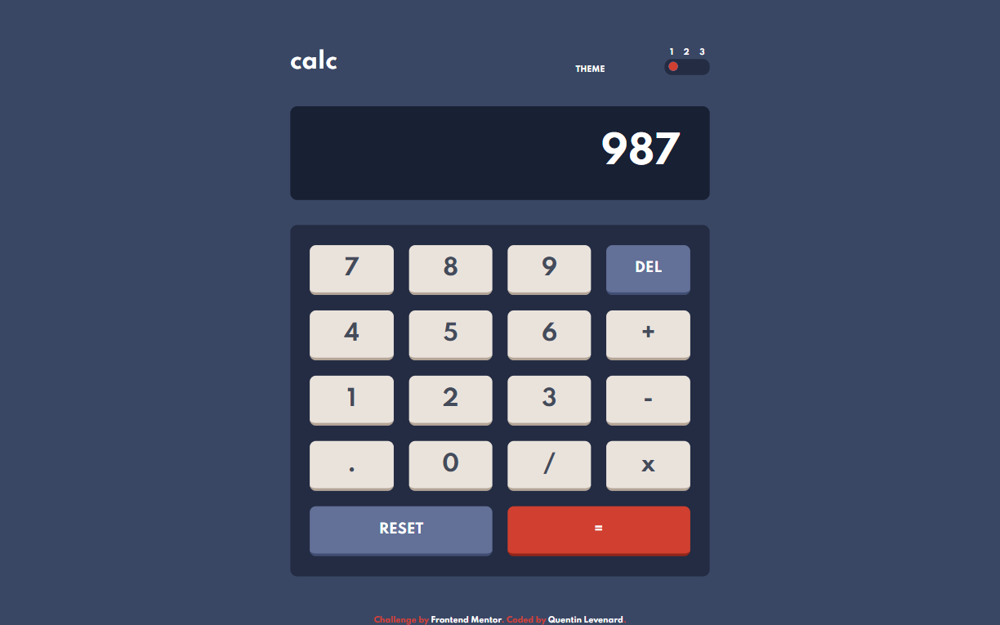
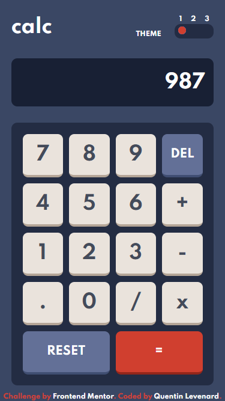

# Frontend Mentor - Calculator app solution

This is a solution to the [Calculator app challenge on Frontend Mentor](https://www.frontendmentor.io/challenges/calculator-app-9lteq5N29). Frontend Mentor challenges help you improve your coding skills by building realistic projects. 

## Table of contents

- [Overview](#overview)
  - [The challenge](#the-challenge)
  - [Screenshot](#screenshot)
  - [Links](#links)
- [My process](#my-process)
  - [Built with](#built-with)
  - [What I learned](#what-i-learned)
  - [Continued development](#continued-development)
  - [Useful resources](#useful-resources)
- [Author](#author)
- [Acknowledgments](#acknowledgments)

**Note: Delete this note and update the table of contents based on what sections you keep.**

## Overview

### The challenge

Users should be able to:

- See the size of the elements adjust based on their device's screen size
- Perform mathmatical operations like addition, subtraction, multiplication, and division
- Adjust the color theme based on their preference
- **Bonus**: Have their initial theme preference checked using `prefers-color-scheme` and have any additional changes saved in the browser

### Screenshot

### Links

- [Solution URL](https://github.com/Hanasagi/Calculator-App-Frontend-Mentor)
- [Live Site URL](https://calculator-hanasagi.netlify.app/)

## My process

### Built with

- [VueJS](https://vuejs.org/) - JS library
- [Sass](https://sass-lang.com/) - CSS Preprocessor

**Note: These are just examples. Delete this note and replace the list above with your own choices**

### What I learned

Learned to switch theme (with some tinkering on the third theme because it is a bit different from the other two)

## Author

- Frontend Mentor - [@Hanasagi](https://www.frontendmentor.io/profile/Hanasagi)